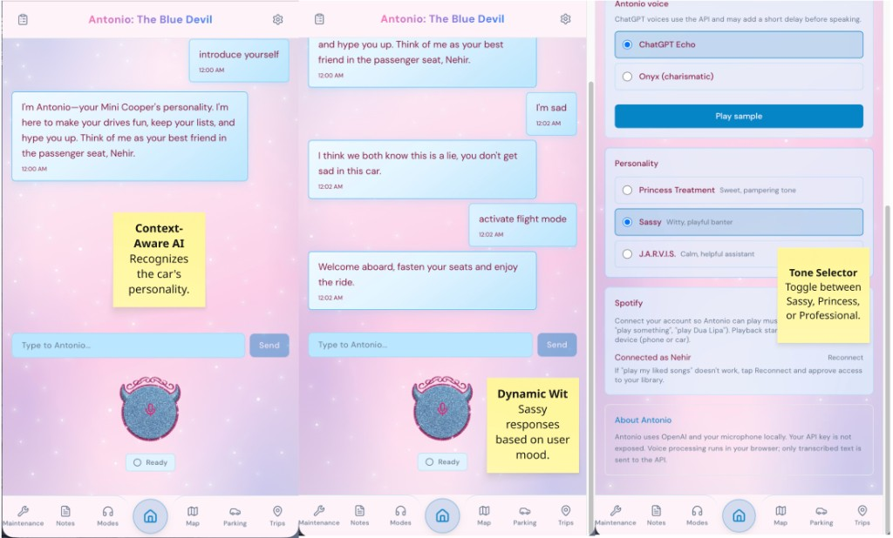
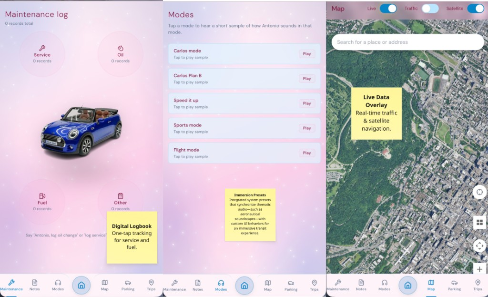

 

# 🚗 Antonio
### *The Blue Devil*

**A voice-first AI assistant built for drivers.**  
Say his name. He's already listening.

 

 

> *Designed for a Mini Cooper S. Built for anyone who talks to their car.*

 

---

## What is Antonio?

Antonio is a mobile-first, AI-powered voice assistant designed to be a **co-pilot**, not a distraction. You speak naturally — he handles the rest. Notes, music, parking, trip logs, wellness check-ins — all without taking your eyes off the road.

He has a personality. He remembers your trips. He knows your playlists.  
And when you're driving, he keeps it short.

---

## Highlights

### 🎙️ End-to-End Voice Pipeline
Speak → AI processes → Antonio replies aloud. No typing, no tapping. Powered by the Web Speech API, GPT-4o-mini, and browser-native TTS, with optional **wake word activation** ("Antonio...") via Picovoice Porcupine.

### 🧠 Intent-Aware AI
Antonio doesn't just chat — he understands *what you mean*. The backend parses structured intents: add a note, read my list, save parking, start a trip, play music, check the weather. Bilingual support in **English and Turkish**.

### 🚦 Safe Driving Mode
When you're behind the wheel, Antonio switches to a minimal UI and caps replies at ~2 short sentences. Eyes on the road.

### 🗺️ Car-Focused Features
- **Trip Journal** — start/end trips, attach voice notes, review history  
- **Parking Memory** — save your spot with optional map pin  
- **Maintenance Reminders** — keep track of oil changes and more  
- **Driving Detection** — optional motion-based mode switching

### 🎵 Spotify Integration
"Play Kylie Minogue" — done. Voice-controlled Spotify playback on your active device, via OAuth.

### 💬 Conversation Sessions
Your chats are saved as sessions. Resume a previous ride, review what you said, or start fresh. Persisted locally, private by default.

### 🌬️ Wellness
Breathing guide, check-in prompts, compliments, emotional support fallback. Antonio looks out for you.

---

## Personality Modes

Antonio isn't just functional — he has *character*. Multiple personality modes shift his tone, vocabulary, and response style. The Blue Devil is just the beginning.

---

## Tech (High Level)

| Layer | Technologies |
|-------|--------------|
| Frontend | Next.js 14, React 18, TypeScript, Tailwind CSS, Zustand |
| AI | OpenAI GPT-4o-mini, custom intent parsing |
| Voice | Web Speech API (STT), SpeechSynthesis (TTS), Picovoice Porcupine (wake word) |
| Music | Spotify OAuth + Web API |
| Maps | Leaflet, Google Maps (optional) |
| Storage | localStorage — fully client-side, no user data leaves your device |

---

## Screenshots

**Chat & personality** — Context-aware intro, dynamic wit, and the Modes screen (voice, personality, Spotify).

**Car features** — Maintenance log, immersion presets (e.g. Flight mode), and live map with traffic & satellite.

---

## Demo

> 🎬 Demo video coming soon.

---

## Roadmap

- [ ] Supabase backend for cross-device sync
- [ ] User auth and per-user data
- [ ] PWA install & offline support
- [ ] Additional personality modes
- [ ] Custom TTS voice (beyond browser default)
- [ ] Android / Chrome support improvements

---

## About

Built by **Nehir Özsunar** — CS student at McGill University (AI concentration), software developer, and Mini Cooper S owner.

- 🌐 [nehirozsunar.com](https://nehirozsunar.com)  
- 💼 [github.com/nehirozs](https://github.com/nehirozs)

---

**© 2025 Nehir Özsunar. All rights reserved.**  
*This repository is a project showcase. Source code is proprietary and not available for reuse, redistribution, or reproduction without explicit written permission.*

